# Mini-lesson: How to TBD (Trunk Based Development)

In this tutorial I will show you the simplest method for managing your software versions for collaboration and stability using Git. There are many ways to manage your git operations, and there is no one right way, but in my opinion Trunk Based Development is the simplest for beginners, the simplest for solo projects, and the simplest for small agile teams. Unless you have a compelling reason to use a more complex method I suggest you start with TBD and stick with it until it's not working for you.

## What is TBD?

TBD is very simple, as long as you have some practice. You have a production, or (hopefully) stable, branch called `main`. This is your source of truth. Any code on the `main` branch is ready for production. In fact, you shouldn't even be able to deploy things to this branch unless they pass all the tests you have written. More on that in later videos, but for now stick with me. The development workflow for TBD involves creating branches all off of a single trunk.

This is what the process looks like for the tree trunk:


Sticking with this analogy here is the workflow you or any other developer on your team would use:

```mermaid

%%{init: {'theme':'dark', 'themeVariables': { 'nodeBorder': '2px solid #444'}}}%%
graph LR
    style A fill:#333,stroke:#FF9F1C,stroke-width:3px;
    style B fill:#333,stroke:#F4D35E,stroke-width:3px;
    style C fill:#333,stroke:#28AFB0,stroke-width:3px;
    style D fill:#333,stroke:#FB6107,stroke-width:3px;
    style E fill:#333,stroke:#FB6107,stroke-width:3px;
    style F fill:#333,stroke:#0FA3B1,stroke-width:3px;
    style G fill:#333,stroke:#F76F8E,stroke-width:3px;
    style H fill:#333,stroke:#F76F8E,stroke-width:3px;
    style I fill:#333,stroke:#5E2BFF,stroke-width:3px;

A[Developer Clones<br>the Main Branch] --> B[Developer Makes<br>Changes Locally]
B -->|Commits| C[Does the Local<br>Code Pass Tests?]
C -->|Yes| D[Create a<br>Pull Request]
C -->|No| E[Fix the<br>Code Locally]
D --> F[Is the Pull<br>Request Approved?]
F -->|Yes| G[Merge Changes<br>to Main Branch]
F -->|No| H[Make Required<br>Changes Locally]
G --> I[Changes Deployed<br>to Production]
E --> C
H --> B



```



### 0/ Clone the repository

```sh

git clone <url-to-remote-repository>

```

### 1/ Pull the latest version of `main`

```sh

git checkout main
git pull

```

### 2/ Create a branch, usually with a simple naming scheme like `feature/name-of-feature/initials`

```sh

git checkout -b feature/farewell-command/swb

```

### 3/ Work on the branch, making small atomic commits with clear descriptive messages

```sh

git add .
git commit -m "Add new command for farewell message."
git push

```

### 4/ Test the branch locally, make sure it works

This part is really important. In order for TBD to work well you need to ensure that you are resolving any issues before merging to `main`. Future you and all your collaborators will thank you.

### 5/ When you're ready pull the latest version of `main`

```sh

git checkout main
git pull

```

### 6/ Merge `main` into your new branch, resolving any merge conflicts locally on your own branch

```sh

git checkout <name-of-your-working-branch>
git merge main

```

### 7/ Push your feature branch to the remote repository

Note that if you are using the git merge editor in your IDE this will likely happen as part of the process. But if you're using more of a manual method it looks just like before.

```sh

git add .
git commit -m "Your message goes here."

```

### 8/ Create a pull request, merge request, basically create a request to complete the merge

### 9/ Write a brief description of changes and expected behavior

### 10/ Submit for review

## Conclusions

That's it! This method is meant to be simple. I like it for cloud infrastructure projects because
